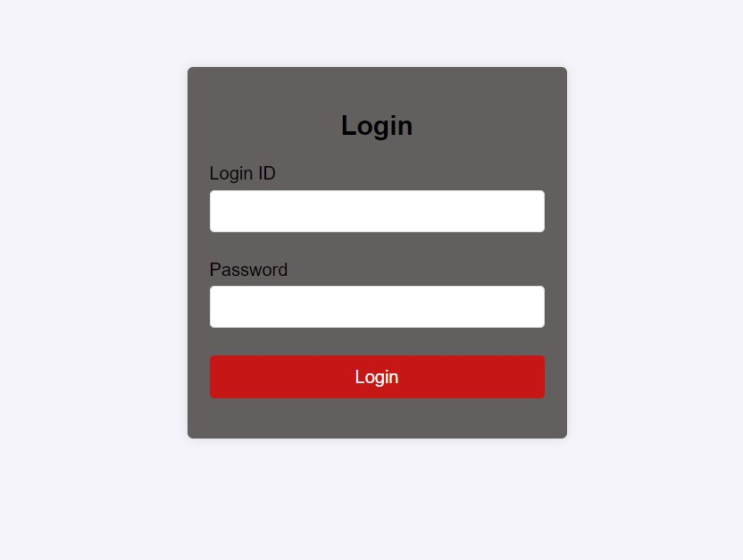

# sunbase_assignment

# Customer Management CRUD Application

This is a Customer Management CRUD application built using Spring Boot for the backend, MySQL for the database, and HTML/CSS/JavaScript for the frontend. The application provides functionality to create, read, update, and delete customer records, along with JWT-based authentication for secure access.


## Features

- **Create Customer**: Add a new customer to the database.
- **Update Customer**: Edit existing customer details.
- **Get Customer List**: Retrieve a paginated, sorted, and searchable list of customers.
- **Get Customer by ID**: Fetch details of a specific customer using their ID.
- **Delete Customer**: Remove a customer from the database.
- **JWT Authentication**: Secure the application using JSON Web Tokens.
- **Sync Data**: Sync Data from sunbase Database.

## UI Screenshots




## Technologies Used

- **Backend**: Java, Spring Boot, JPA
- **Frontend**: HTML, CSS, JavaScript
- **Database**: MySQL
- **Authentication**: JWT

## Prerequisites

- **Java**: JDK 8 or later
- **Maven**: 3.6 or later
- **MySQL**: 5.7 or later

## Getting Started

### Backend Setup

1. **Clone the repository**:
    ```bash
    git clone https://github.com/sagu29/sunbase_assignment.git;
    cd backend
    ```

2. **Configure the MySQL Database**:

    Create a database named `customer_db` and update the `application.properties` file in the `src/main/resources` directory with your database credentials:
    ```properties
    spring.datasource.url=jdbc:mysql://localhost:3306/customer_db
    spring.datasource.username=yourusername
    spring.datasource.password=yourpassword
    spring.jpa.hibernate.ddl-auto=update
    spring.jpa.show-sql=true
    ```

3. **Build and Run the Backend**:
    ```bash
    mvn clean install
    mvn spring-boot:run
    ```

    The backend server will run on `http://localhost:8080`.

   
3. **Create admin by postman**:
    
   curl --location 'http://localhost:8080/auth/signup' \
--header 'Content-Type: application/json' \
--data-raw '{
    "email":"sagar@gmail.com",
    "password":"12345"
}'
    

### Frontend Setup

1. **Open the frontend directory**:

   Navigate to the directory containing your HTML, CSS, and JavaScript files.

2. **Run the Frontend**:

   Simply open the `index.html` file in your web browser to access the frontend.

## API Endpoints
- **GET /customers**: Retrieve a list of customers with searching.
- **GET /customers/{id}**: Get a customer by ID.
- **POST /customers**: Create a new customer.
- **PUT /customers**: Update an existing customer.
- **DELETE /customers/{id}**: Delete a customer by ID.
- **PATCH /customers/sync**: Sync customers data from sunbase database.

## Authentication

- **Register**: Use the `/auth/signup` endpoint to create a new user.
- **Login**: Use the `/auth/login` endpoint to authenticate and receive a JWT token.
- **Secure API Calls**: Include the JWT token in the `Authorization` header as a Bearer token for protected endpoints.
